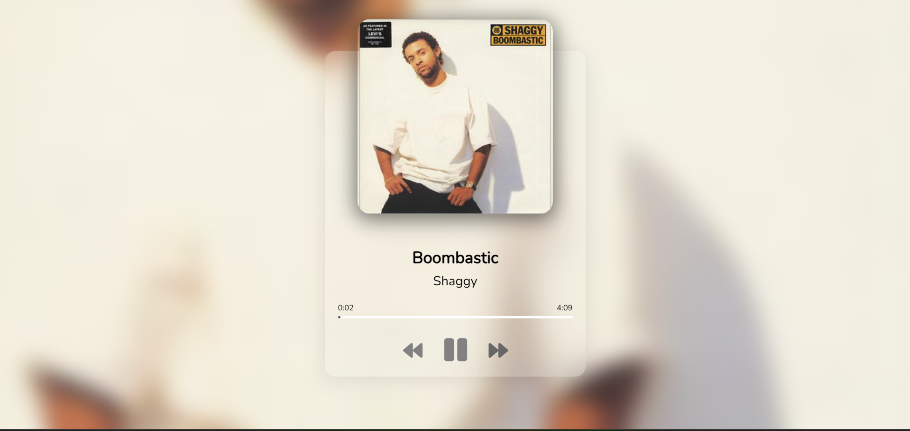

# 🎸Music Gallery
The Music Player web application is a simple yet functional platform for playing a list of songs.
Developed using HTML, CSS, and JavaScript, it provides a user-friendly interface to control playback.
The project is built using HTML for structure, CSS for styling, and JavaScript for functionality.By building this project you will get an idea about working of different JavaScript functions such as addEvent Listener.This project is a simple but contains lot of important concepts in JavaScript. By understanding these important concepts you can develop more projects.
# ScreenShot
